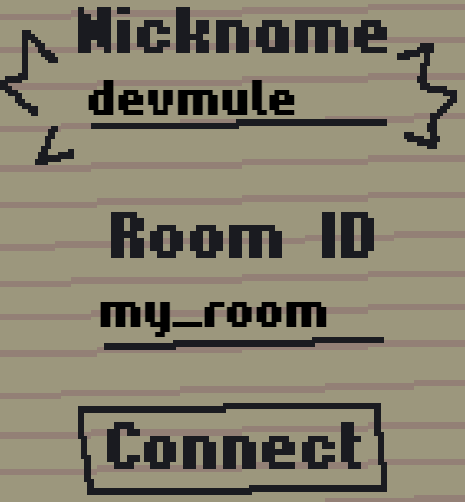
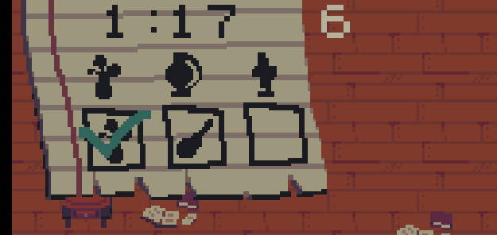
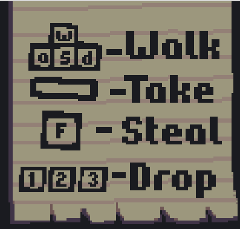
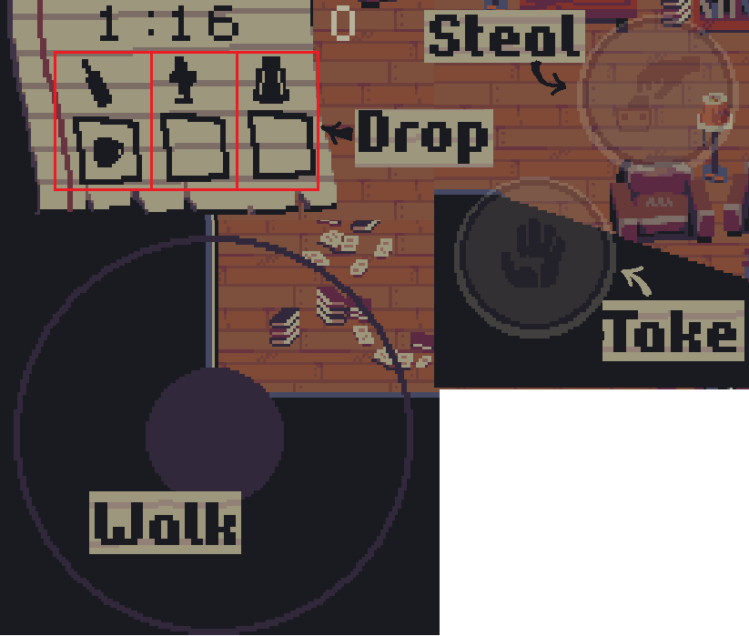

# Hurry Up
 

Тема: “lost and found”.

диверсификаторы: 
- Маловероятные союзники
- RNG  

### ***Hurry Up*** - мультиплеерная аркада
	
### Введение:  
Мы обратились к теме Lost and found максимально грубо, прямолинейно и жизненно. Ежедневно, даже не выходя из дома, 
мы теряем множество различных крайне необходимых вещей, будь то любимая кружка или гораздо более любимая катана. 
Однако, бывают ситуации, когда не ты один теряешь необходимую вещицу, что слегка отягощает ситуацию. Hurry Up призвана 
обучить молодого бойца находить любые вещи в максимально короткие сроки в условиях массовой истерии поиска столь 
необходимых вещей

### Как играть:  
Необходимо набрать как можно больше баллов за две минуты. Тем болше баллов, чем больше времени ты носишь
нужные тебе предметы. Чтобы не дать набрать баллы соперникам, можно воровать у них предметы.

1. В Hurry Up мультиплеер реализован по принципу peer-to-peer. Перед игрой игроки подключаются к "комнате".  
Чтобы играть в одной комнате, неоходимо ввести одинаковый room-id и нажать кнопку Connect.  
​

2. Игра длится раундами по 2 минуты. Между раундами безвременный период ожидания. Первый игрок в комнате - хост. 
Он выбирает когда начинать игру.  
У хоста во время ожидания есть такая кнопка:  
​

3. Когда кнопка нажата, начинается игра. Все игроки получают случайный набор необходимых для поиска предметов.  
Список необходимых предметов и инвентарь находятся в верхнем левом углу экрана.  
Там же расположены таймер, отображающий оставшееся время и счётчик баллов.  

Если игрок подбирает необходимый предмет в соответствующую ячейку, то он отмечается галочкой.  
Счётчик баллов увеличивается постоянно если игрок собрал как минимум один необходимый предмет. 
И чем больше необходимых предметов собрано, тем быстрее увеличивается счётчик.

4. Игрок может:  
4.1 Поднимать предметы, если есть свободное место в инвентаре.  
4.2 Выкидывать ненужные предметы из ячеек инвентаря.  
4.3 Обворовывать других игроков.  

5. В Hurry Up можно играть как с телефона, так и с ПК. Управление для пк реализовано через клавиатуру, 
а для мобильников через джоистик и кнопки.  

  
Включить или выключить мобильный решим можно в любой момент.
